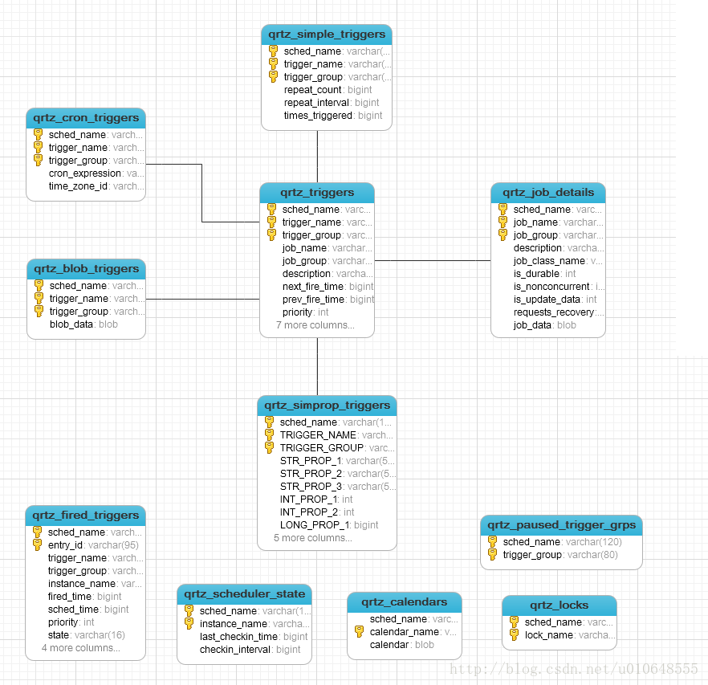
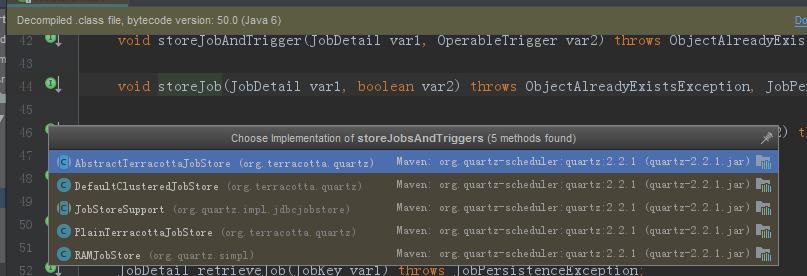

[TOC]

# Quartz


## 一. Quartz 大致简介

1. Quartz 是完全由 <u>java</u> 开发的一个<u>开源</u>的**任务日程管理系统**

  ​任务日程管理系统 换句话说就是:

  ​	一个预先确定的日程时间到达时,负责执行任务的一个系

2. Quartz用一个.jar 库文件,其包含了所有Quartz的核心功能, 

   1. 这些功能有一个主要的接口:  **Schedule接口**

       它提供了简单的操作   例如: 

       ​	将任务纳入日程或者从日程中取消

       ​	开始/停止/暂停日程进度

3. 定时器的种类: 

   Quartz中有五中类型的Trigger:

   - *SimpleTrigger*   : 用来触发只需执行一次或者在给定时间触发并且重复N次 且每次执行延迟一定时间的任务
   - *CronTrigger* : 按照日历触发,例如 每个周五 每个月的1号凌晨 2:30 
   - DateIntervalTrigger
   - NthIncludedDayTrigger
   - Calendar 类(org.quartz.Calendar)

4.  存储方式:

   Quartz自身支持 两种存储方式: 

   - RAMJobStore  (顾明思议 存放在当前内存)
   - JDBCJobStore  (通过jdbc实例到数据库)

   对比: 

   | 存储类型         | 优点                  | 缺点                                       |
   | ------------ | ------------------- | ---------------------------------------- |
   | RAMJobStore  | 不需要外部数据库,配置简单,运行速度快 | 因为调度程序信息存储在jvm  所以jvm程序停止运行时 将有丢失   且因为内存大小也有存储个数限制 |
   | JDBCJobStore | 可以存储到数据库中可以控制事物     | 因为需要连接数据库 所以运行速度有所影响                     |

5. 表关系及解释

   

|                           |                                          |
| :------------------------ | :--------------------------------------- |
| 表名称                       | 说明                                       |
| qrtz_blob_triggers        | Trigger作为Blob类型存储(用于Quartz用户用JDBC创建他们自己定制的Trigger类型，JobStore 并不知道如何存储实例的时候) |
| qrtz_calendars            | 以Blob类型存储Quartz的Calendar日历信息， quartz可配置一个日历来指定一个时间范围 |
| qrtz_cron_triggers        | 存储Cron Trigger，包括Cron表达式和时区信息。           |
| qrtz_fired_triggers       | 存储与已触发的Trigger相关的状态信息，以及相联Job的执行信息       |
| qrtz_job_details          | 存储每一个已配置的Job的详细信息                        |
| qrtz_locks                | 存储程序的非观锁的信息(假如使用了悲观锁)                    |
| qrtz_paused_trigger_graps | 存储已暂停的Trigger组的信息                        |
| qrtz_scheduler_state      | 存储少量的有关 Scheduler的状态信息，和别的 Scheduler 实例(假如是用于一个集群中) |
| qrtz_simple_triggers      | 存储简单的 Trigger，包括重复次数，间隔，以及已触的次数          |
| qrtz_triggers             | 存储已配置的 Trigger的信息                        |
| qrzt_simprop_triggers     |                                          |

6. 核心类和关系

   1. 核心类

      - **QuartzSchedulerThread**:

        负责执行向QuartzScheduler注册的触发Trigger的工作线程

      - **ThreadPool** :

        Scheduler使用一个线程作为任务运行的基础设施,任务通过共享线程池中的线程提高运行效率

      - **QuartzSchedulerResources** :

        包含穿件QuartzScheduler实例所需的所有资源(JobStore,ThreadPool等)

      -  **JobStore** :

        通过类实现的接口,这些类要为org.quartz.core.QuartzScheduler的使用提供一个org.quartz.Job和org.quartz.Trigger存储机制.作业和触发器的存储应该以其名称和组的组合为唯一性

      - **QuartzScheduler** :

        Quartz的核心,他是org.quartz.Scheduler接口的间接实现,包含调度org.quartz.Jobs ,注册org.quartz.JobListener实例等的方法

      - **Scheduler** :

        这是Quartz Scheduler的主要接口,代表一个独立运行容器. 调度程序维护JobDetails和触发器的注册表.一旦注册,调度程序负责执行作业,当她们的相关连的触发器触发(当她们的预定时间到达时 )

      - **Trigger**: 

        具有所有触发器通用属性的基本接口,描述了job执行的时间触发规则,

        使用TriggerBuilder实例化实际触发器

      - **JobDetail** : 

        传递给定作业实例的详细信息属性.

        JobDetails将使用JobBuilder创建/定义

      - **Job** :

        表示要执行的"作业"的类的实现接口. 

        只有一个方法:

        void execute(JobExecutionContext context);

        (JobExecutionContext 提供调度上下文各种信息,运行时数据保存在jobDataMap中 )

        Job 有个子接口StatefulJob,代表没有状态任务

        ​

        ***有状态任务不可并发,前次任务没有执行完,后面任务则一直处于阻塞等待状态*** 

   2. **一个job可以被多个Trigger 绑定，但是一个Trigger只能绑定一个job！**

      .jpg)

7. quartz.properties  Quartz可更改配置

   ```properties
   //调度标识名 集群中每一个实例都必须使用相同的名称 （区分特定的调度器实例）
   org.quartz.scheduler.instanceName：DefaultQuartzScheduler
   //ID设置为自动获取 每一个必须不同 （所有调度器实例中是唯一的）
   org.quartz.scheduler.instanceId ：AUTO
   //数据保存方式为持久化
   org.quartz.jobStore.class ：org.quartz.impl.jdbcjobstore.JobStoreTX
   //表的前缀
   org.quartz.jobStore.tablePrefix ： QRTZ_
   //设置为TRUE不会出现序列化非字符串类到 BLOB 时产生的类版本问题
   //org.quartz.jobStore.useProperties ： true
   //加入集群 true 为集群 false不是集群
   org.quartz.jobStore.isClustered ： false
   //调度实例失效的检查时间间隔
   org.quartz.jobStore.clusterCheckinInterval：20000
   //容许的最大作业延长时间
   org.quartz.jobStore.misfireThreshold ：60000
   //ThreadPool 实现的类名
   org.quartz.threadPool.class：org.quartz.simpl.SimpleThreadPool
   //线程数量
   org.quartz.threadPool.threadCount ： 10
   //线程优先级
   org.quartz.threadPool.threadPriority ： 5（threadPriority 属性的最大值是常量 java.lang.Thread.MAX_PRIORITY，等于10。最小值为常量 java.lang.Thread.MIN_PRIORITY，为1）
   //自创建父线程
   //org.quartz.threadPool.threadsInheritContextClassLoaderOfInitializingThread： true
   //数据库别名
   org.quartz.jobStore.dataSource ： qzDS
   //设置数据源
   org.quartz.dataSource.qzDS.driver:com.mysql.jdbc.Driver
   org.quartz.dataSource.qzDS.URL:jdbc:mysql://localhost:3306/quartz
   org.quartz.dataSource.qzDS.user:root
   org.quartz.dataSource.qzDS.password:123456
   org.quartz.dataSource.qzDS.maxConnection:10
   ```

8. JDBC插入表顺序

   ```sql
   主要的JDBC操作类，执行sql顺序: 

   	基本顺序: 
   		记录工作内容   
   		插入触发器列表   
   		对应类型trigger规则入库   
   		存储已触发job信息和trigge信息
   		
   Simple_trigger ：插入顺序
   qrtz_job_details ---> qrtz_triggers ---> qrtz_simple_triggers
   qrtz_fired_triggers

   Cron_Trigger：插入顺序
   qrtz_job_details ---> qrtz_triggers ---> qrtz_cron_triggers
   qrtz_fired_triggers
   ```

9. 主要API

   - **Scheduler** - 用于与调度程序交互的主程序接口。
   - **Job** - 我们预先定义的希望在未来时间能被调度程序执行的任务类，如上一节的HelloJob类。
   - **JobDetail** - 使用**JobDetail**来定义定时任务的实例。
   - **Trigger** - 触发器，表明任务在什么时候会执行。定义了一个已经被安排的任务将会在什么时候执行的时间条件
   - **JobBuilder** -用于声明一个任务实例，也可以定义关于该任务的详情比如任务名、组名等，这个声明的实例将会作为一个实际执行的任务。
   - **TriggerBuilder** - 触发器创建器，用于创建触发器trigger实例。


## 二 . Cron 表达式

1. 为什么要使用cron表达式

   我们之前提到  有五种触发器归我们使用

   其中常用的 有 SimpleTrigger 和 CronTrigger

   - SimpleTrigger 是完全指定的时间反复进行工作的时间表


   - CronTrigger 却拥有着 充分的可根据日历预定的 方案    且它包含Simple方案中的 初始启动时间

     例如: 

     - 每个星期五中午
     - 每个工作日的早上10:30 
     - 周三周五 9:00-10:00 每五分钟一次

2. Cron Expressions 

   Cron 表达式并不是只是使用在 Quartz中的  ,实际上它作为一种专门的表达式也应用在Linux的定时任务中 ,以及在java中Spring的@Scheduled注解 也都使用了

   Cron表达式是 字符串形式

   Cron本质上是由**七个 子表达式**,描述个别细节的时间表  而这些子表达式是由**空格**分开的

   ##子表达式:##

   |  位置  |         意义          | 有效值                                      | 可用特殊字符                          |
   | :--: | :-----------------: | ---------------------------------------- | ------------------------------- |
   |  1   |     **Seconds**     | 0－59                                     | , - * /                         |
   |  2   |     **Minutes**     | 0－59                                     | , - * /                         |
   |  3   |      **Hours**      | 0 - 23                                   | , - * /                         |
   |  4   |  **Day-of-Month**   | 1 - 31  ( 注意一些特别的月份)                     | , - * /           **?  L W **   |
   |  5   |      **Month**      | 0 - 11  <br />或  <br />字符串  “JAN, FEB, MAR, APR,<br /> MAY, JUN, JUL, AUG, SEP, OCT, NOV DEC” | , - * /                         |
   |  6   | **Day-of-Week**(每周) | 1 - 7  <br />或 <br />字符串“SUN, MON, TUE, WED, THU, <br />FRI, SAT”表示     ***** **注意: 1==SUN** | , - * /            **?  L  # ** |
   |  7   |  **Year**(年 可选字段)   | empty 或者 1970-2099                       | , - * /                         |

   3. 特殊字符

      显然通过子表达式并不能写出一个 重复执行的表达式 

      而特殊字符就是来解决当前问题的

   ##特殊字符 :##

   |  符号  |      表示       | 举例说明                                     |
   | :--: | :-----------: | ---------------------------------------- |
   |  /   |       每       | 与当前子表达式结合使用占用一个子表达式位置<br /> 例: "3/15" 放在第二个子表达式位上, 表示第三分钟开始执行,每15分钟执行一次 |
   |  ?   |      某一天      | 只存在与 Day-of-Month 和 Day-of-Week 中使用,来解决 这两个表达式的冲突问题 在其中一个子表达式有值的情况下 ?写在另一个表达式上表示匹配任意值,这样我们就不会再用* 去来表示匹配任意值了<br />例: 每月15号的早上4点 : "0 0 4 15 * ?"<br />每周五晚上11点: "0 0 23 ? * FRI" |
   |  L   | 每月 或每周  的最后一天 | 只存在与 Day-of-Month 和 Day-of-Week 中使用,<br />在 **Day-of-Month** 子表达式中，**“L”表示一个月的最后一天** <br />在 **Day-of-Week** 子表达式中，**“L”表示一个星期的最后一天，**也就是SAT<br /> 例: “0 15 10 ? * 6L”  表示   每月最后一个星期五10:15分运行。   <br />       "0 15 10 2L * ?"   表示   每月倒数第二天10:15分运行。 |
   |  W   |     最近工作日     | 只存在与 Day-of-Month<br />最近的工作日: 例: "0 15 10 15W * ?" 每个月距离15日最近的工作日  如 15日是周六则执行时间是14日 若15日是周日 则执行时间是16 如15号是工作日就15执行    就近匹配不会跨出当前月 |
   |  #   |    第几个星期几     | 只存在与 Day-of-Week 中<br /> 每月第n个工作日<br />例:“0 15 10 ? * 6#3”  表示每个月第三个星期五 <br />     “0 15 10 ? * 4#2”  表示每个月第二个星期三 |
   |  ,   |      多个       | 例: "0 0 ***0,13,18,21*** * * ?": 每天的0点、13点、18点、21点都执行一次： |
   |  -   |      区间       | 例:  "0 ***0-5*** 14 * * ?" : 在每天下午2点到下午2:05期间的每1分钟触发 |
   |  *   |      补位符      | 补位  但是  **注意:** Day-of-Month 和 Day-of-Week 肯定有一个为 ?  也不能两个 ? |

   综合例子:

   "0 30 0-4 ? 3,7 5#2 2018": 	

   ​						每30分钟执行一次

   ​						凌晨的0-4 点

   ​						每个月

   ​						3 月和 7月

   ​						第二个周四 

   ​						2018年

   ​		: 2018年 的三月和7月的第二个周四的凌晨0-4点 开始每30分钟执行一次      

   "0 30 4 10LW * ?":

   ​	第四位是 Day-of-Month  L在此表示 每个月最后

   ​	10L表示每月的倒数第十天   (不一定是21号  月份不同倒数的第几天也就不同 )
   ​	W表示 附近的工作日  

   ​	所以表示每个月离倒数第十天最近的工作日的凌晨4点30分执行一次

   "0 0-15/2 14 * * ?"  在每天下午2点到下午2:15期间的每2分钟触发一次


## 三. Hello Quartz! 

​	我会跟着 第一章 6.2 的图来 进行同步代码编写 

 1.  简单入门示例:

     1. 创建一个新的java普通工程    引入对应版本jar包: 

        jar包 maven地址为: 

        ```xml
               <!-- Quartz jar 包 2.2.1 版本 -->
        		<dependency>
                    <groupId>org.quartz-scheduler</groupId>
                    <artifactId>quartz</artifactId>
                    <version>2.2.1</version>
                </dependency>
                <dependency>
                    <groupId>org.quartz-scheduler</groupId>
                    <artifactId>quartz-jobs</artifactId>
                    <version>2.2.1</version>
                </dependency>
        		<!-- 若你使用的框架是SpringBoot 需要引入:  
        			这里只是个示例简单程序  所以只需要导入上面两个的依赖就可 
        		-->
             	<!--<dependency>-->
                    <!--<groupId>org.springframework</groupId>-->
                    <!--<artifactId>spring-context-support</artifactId>-->
                    <!--<version>4.1.6.RELEASE</version>-->
                <!--</dependency>-->

        ```

     2. 自创建任务 (Job)

        仅仅需要对 org.quartz.Job 接口进行实现     将来调度器会执行我们重写的execute()方法

        ```java
        package com.ws.quartzdemo1001.job01_HelloWorld;

        import org.quartz.Job;
        import org.quartz.JobExecutionContext;
        import org.quartz.JobExecutionException;
        import org.slf4j.Logger;
        import org.slf4j.LoggerFactory;

        /**
         * 实现 quartz 对使用人员开放的 Job接口
         */
        public class HelloJob implements Job {

            private static Logger log = LoggerFactory.getLogger(HelloJob.class);

            @Override
            public void execute(JobExecutionContext jobExecutionContext)
                    throws JobExecutionException {
                log.info("Hello Quartz - Job");
            }
        }
        ```

     3.   编写使用Quartz的代码

        ```java
        package com.ws.quartzdemo1001.job01_HelloWorld;

        import org.quartz.*;
        import org.quartz.impl.StdSchedulerFactory;
        import org.slf4j.Logger;
        import org.slf4j.LoggerFactory;
        import java.util.Date;

        public class HelloQuartz {
            private static Logger logger = LoggerFactory.getLogger(HelloQuartz.class);

            public static void main(String[] args) throws SchedulerException {
                // 1 创建 Scheduler 的工厂
                SchedulerFactory schedulerFactory = new StdSchedulerFactory();
                // 2 从工厂中获取调度器 的实例
                Scheduler scheduler = schedulerFactory.getScheduler();
                // 3 创建JobDetail
                JobDetail jobDetail = JobBuilder.newJob(HelloJob.class)
                        .withDescription("this is my first job01_HelloWorld ")  // 设置job相关描述
                        .withIdentity("hello job01_HelloWorld" ,"normal job01_HelloWorld") // 设置任务 名称和组名
                        .build(); //创建 JobDetail
                // 4 创建 trigger
                CronTrigger trigger = TriggerBuilder.newTrigger()
                        .withDescription("this is my first trigger") //设置 trigger 相关描述
                        .withIdentity("say hello trigger", "cron trigger") //设置 当前触发其 名字 和归属组名
                        .startAt(new Date()) // 设置任务启动时间
                        .withSchedule(CronScheduleBuilder.cronSchedule("0/10 * * * * ?"))
                        .build();
                // 5 将 job01_HelloWorld 和 trigger 绑定 并注册到 调度器
                scheduler.scheduleJob(jobDetail,trigger);
                // 6 启动 调度器
                scheduler.start();
                logger.info(new Date() +"    <<<<<<  启动");
            }
        }

        ```

        主要编写了:  

        - 创建了Scheduler 工厂 
        - 从工厂中获取调度器的实例
        - 使用自己实现了Job接口的类 来创建 JobDetail 
        - 创建触发器 并指定触发规则
        - 将JobDetail 和触发器进行绑定放入 调度器中  (或者说注册到scheduler)
        - 启动调度器

     4. 执行结果:

        .jpg)


2. 入门示例 (追根溯源)

-  作为一个简单的应用程序 我们使用起来给我最大的感触就是 每个主要实例都有一个特定的创建方法

  比如 调度器实例就是依靠 Scheduler工厂而创建出来为我们使用

  JobDetail 和Trigger 亦是如此

- HelloJob代码分析: 

  接口: org.quartz.Job 

  ```java
  // Source code recreated from a .class file by IntelliJ IDEA
  // (powered by Fernflower decompiler)

  package org.quartz;

  public interface Job {
      void execute(JobExecutionContext context) throws JobExecutionException;
  }

  ```

  *一个任务是一个实现Job接口的类, 且任务类必须含有空构造器* 

  当关联这个任务实例的触发器声明的执行时间到了的时候,调度程序Scheduler 会调用这个execute()方法来执行任务,我们的任务内容就可以在这个方法中执行

  JobExecutionContext: 工作执行的上下文  自动传入  

  ​					实际上在该方法退出之前会设置一个结果对象到 上下文中 ,

  ​					来让JobListeners 或者TriggerListeners 获得当前任务执行的状态

- HelloQuartz 代码分析: 

  ```java
   // 1 创建 Scheduler 的工厂
          SchedulerFactory schedulerFactory = new StdSchedulerFactory();
  ```

  创建一个生产调度器的工厂  

  查看Scheduler 接口源码: 

  ```java
  // Source code recreated from a .class file by IntelliJ IDEA
  // (powered by Fernflower decompiler)

  package org.quartz;

  import java.util.Collection;

  public interface SchedulerFactory {
      Scheduler getScheduler() throws SchedulerException;

      Scheduler getScheduler(String var1) throws SchedulerException;

      Collection<Scheduler> getAllSchedulers() throws SchedulerException;
  }

  ```

  接口规范了 三个必须实现的方法: 

  ​	三个方法的作用实际上都是 来获取 调度器实例		

   * getScheduler()  
  * getScheduler(String schedName)  // 返回指定了名字的调度器实例
  * getAllSchedulers()  

  Scheduler 的实现有 两种: 

  ​	.jpg)

  代码中创建的是 new StdSchedulerFactory() ;

  ​	查看 DirectSchedulerFactory 中实现代码: 

  ```java

  public class DirectSchedulerFactory implements SchedulerFactory {
      public static final String DEFAULT_INSTANCE_ID = "SIMPLE_NON_CLUSTERED";
      public static final String DEFAULT_SCHEDULER_NAME = "SimpleQuartzScheduler";
      private static final boolean DEFAULT_JMX_EXPORT = false;
      private static final String DEFAULT_JMX_OBJECTNAME = null;
      private static final DefaultThreadExecutor DEFAULT_THREAD_EXECUTOR = new DefaultThreadExecutor();
      private static final int DEFAULT_BATCH_MAX_SIZE = 1;
      private static final long DEFAULT_BATCH_TIME_WINDOW = 0L;
      private boolean initialized = false;
      private static DirectSchedulerFactory instance = new DirectSchedulerFactory();
      private final Logger log = LoggerFactory.getLogger(this.getClass());

      protected Logger getLog() {
          return this.log;
      }

      protected DirectSchedulerFactory() {
      }
    
    ....
  ```

  仅从字面意思上理解 DirectSchedulerFactory 就是一个**直接的** 调度器创建工厂 

  ``` java
   public static final String DEFAULT_INSTANCE_ID = "SIMPLE_NON_CLUSTERED";
   public static final String DEFAULT_SCHEDULER_NAME = "SimpleQuartzScheduler";
  ```

  开始两行中明确指明 这个直接的工厂 是没有实现分布式集群  而且预期返回 简单的调度器 实例

  再对比 StdSchedulerFactory的 源码: 

  ```java
  public class StdSchedulerFactory implements SchedulerFactory {
      public static final String PROPERTIES_FILE = "org.quartz.properties";
      public static final String PROP_SCHED_INSTANCE_NAME = "org.quartz.scheduler.instanceName";
      public static final String PROP_SCHED_INSTANCE_ID = "org.quartz.scheduler.instanceId";
      public static final String PROP_SCHED_INSTANCE_ID_GENERATOR_PREFIX = "org.quartz.scheduler.instanceIdGenerator";
      public static final String PROP_SCHED_INSTANCE_ID_GENERATOR_CLASS = "org.quartz.scheduler.instanceIdGenerator.class";
      public static final String PROP_SCHED_THREAD_NAME = "org.quartz.scheduler.threadName";
      public static final String PROP_SCHED_SKIP_UPDATE_CHECK = "org.quartz.scheduler.skipUpdateCheck";
      public static final String PROP_SCHED_BATCH_TIME_WINDOW = "org.quartz.scheduler.batchTriggerAcquisitionFireAheadTimeWindow";
      public static final String PROP_SCHED_MAX_BATCH_SIZE = "org.quartz.scheduler.batchTriggerAcquisitionMaxCount";
      public static final String PROP_SCHED_JMX_EXPORT = "org.quartz.scheduler.jmx.export";
      public static final String PROP_SCHED_JMX_OBJECT_NAME = "org.quartz.scheduler.jmx.objectName";
      public static final String PROP_SCHED_JMX_PROXY = "org.quartz.scheduler.jmx.proxy";
      public static final String PROP_SCHED_JMX_PROXY_CLASS = "org.quartz.scheduler.jmx.proxy.class";
      public static final String PROP_SCHED_RMI_EXPORT = "org.quartz.scheduler.rmi.export";
      public static final String PROP_SCHED_RMI_PROXY = "org.quartz.scheduler.rmi.proxy";
      public static final String PROP_SCHED_RMI_HOST = "org.quartz.scheduler.rmi.registryHost";
      public static final String PROP_SCHED_RMI_PORT = "org.quartz.scheduler.rmi.registryPort";
      public static final String PROP_SCHED_RMI_SERVER_PORT = "org.quartz.scheduler.rmi.serverPort";
      public static final String PROP_SCHED_RMI_CREATE_REGISTRY = "org.quartz.scheduler.rmi.createRegistry";
      public static final String PROP_SCHED_RMI_BIND_NAME = "org.quartz.scheduler.rmi.bindName";
      public static final String PROP_SCHED_WRAP_JOB_IN_USER_TX = "org.quartz.scheduler.wrapJobExecutionInUserTransaction";
      public static final String PROP_SCHED_USER_TX_URL = "org.quartz.scheduler.userTransactionURL";
      public static final String PROP_SCHED_IDLE_WAIT_TIME = "org.quartz.scheduler.idleWaitTime";
      public static final String PROP_SCHED_DB_FAILURE_RETRY_INTERVAL = "org.quartz.scheduler.dbFailureRetryInterval";
      public static final String PROP_SCHED_MAKE_SCHEDULER_THREAD_DAEMON = "org.quartz.scheduler.makeSchedulerThreadDaemon";
      public static final String PROP_SCHED_SCHEDULER_THREADS_INHERIT_CONTEXT_CLASS_LOADER_OF_INITIALIZING_THREAD = "org.quartz.scheduler.threadsInheritContextClassLoaderOfInitializer";
      public static final String PROP_SCHED_CLASS_LOAD_HELPER_CLASS = "org.quartz.scheduler.classLoadHelper.class";
      public static final String PROP_SCHED_JOB_FACTORY_CLASS = "org.quartz.scheduler.jobFactory.class";
      public static final String PROP_SCHED_JOB_FACTORY_PREFIX = "org.quartz.scheduler.jobFactory";
      public static final String PROP_SCHED_INTERRUPT_JOBS_ON_SHUTDOWN = "org.quartz.scheduler.interruptJobsOnShutdown";
      public static final String PROP_SCHED_INTERRUPT_JOBS_ON_SHUTDOWN_WITH_WAIT = "org.quartz.scheduler.interruptJobsOnShutdownWithWait";
      public static final String PROP_SCHED_CONTEXT_PREFIX = "org.quartz.context.key";
      public static final String PROP_THREAD_POOL_PREFIX = "org.quartz.threadPool";
      public static final String PROP_THREAD_POOL_CLASS = "org.quartz.threadPool.class";
      public static final String PROP_JOB_STORE_PREFIX = "org.quartz.jobStore";
      public static final String PROP_JOB_STORE_LOCK_HANDLER_PREFIX = "org.quartz.jobStore.lockHandler";
      public static final String PROP_JOB_STORE_LOCK_HANDLER_CLASS = "org.quartz.jobStore.lockHandler.class";
      public static final String PROP_TABLE_PREFIX = "tablePrefix";
      public static final String PROP_SCHED_NAME = "schedName";
      public static final String PROP_JOB_STORE_CLASS = "org.quartz.jobStore.class";
      public static final String PROP_JOB_STORE_USE_PROP = "org.quartz.jobStore.useProperties";
      public static final String PROP_DATASOURCE_PREFIX = "org.quartz.dataSource";
      public static final String PROP_CONNECTION_PROVIDER_CLASS = "connectionProvider.class";
  .....
    
  ```

  看起来明显区别是相对于 简单的调度器实例来说 它多出了好多常量

  从常量: PROPERTIES_FILE 中可以看出 它实际上是 对应的一个配置 

  我们再返回去查看 第一章 .7 的properties 配置文件中的 可以配置的属性

  不难发现  其实我们可以设置的配置 再quartz的声明处 就在 这里

  **它为我们创建了的调度器实现了各种复杂模式**

  ​

  作为初始demo我现在不再深入它的具体实现 

  继续进行代码分析: 

  ```java
  	JobDetail jobDetail = JobBuilder.newJob(HelloJob.class)
                  .withDescription("this is my first job01_HelloWorld ")  // 设置job相关描述
                  .withIdentity("hello job01_HelloWorld" ,"normal job01_HelloWorld") // 设置任务 名称和组名
                  .build(); //创建 JobDetail
  ```


  **这里我们使用了 JobBulider  返回的是 JobDetail** 

  使用JobBulider 的newJob 方法 将 我们自实现的工作类当做参数传入 

  追溯源码: 

  ````java

  public class JobBuilder {
      private JobKey key;
      private String description;
      private Class<? extends Job> jobClass;
      private boolean durability;
      private boolean shouldRecover;
      private JobDataMap jobDataMap = new JobDataMap();
    ...
     	protected JobBuilder() {
      }
      public static JobBuilder newJob() {
          return new JobBuilder();
      }
      public static JobBuilder newJob(Class<? extends Job> jobClass) {
          JobBuilder b = new JobBuilder();
          b.ofType(jobClass);
          return b;
      }
    ...
       public JobBuilder ofType(Class<? extends Job> jobClazz) {
          this.jobClass = jobClazz;
          return this;
      }
    ...
  ````

  - 发现 JobBuilder 的静态方法中 实例了一个 JobBuilder的对象  


  - 并调用了 ofType 将我们传入的自实现的工作类设置成这个对象的 成员属性


  - 再看 构造器 权限是 protected 

  *看上去感觉像是 单例模式 不能直接创建 对象~!!! 而是提供一个静态方法 返回一个当前类的一个实例*

  *区别就是 这个方法是个有参数的调用*  

  ​

  ok  我们现在就深入了解到这里  jobClass 具体什么时候使用 我们慢慢探索 

  总体看起来 **JobBuilder只是一个 充满 附加参数的 而且封装了Job的Pojo一样**

  继续代码分析  发现:

  ```java
  .withDescription("this is my first job01_HelloWorld ")  // 设置job相关描述
  ```

  没有什么可以赘述

  ```java
   .withIdentity("hello job01_HelloWorld" ,"normal job01_HelloWorld") // 设置任务 名称和组名
  ```

  看一下 设置身份  它传入了两个 参数 

  源码查看: 

  ```java
      public JobBuilder withIdentity(String name, String group) {
          this.key = new JobKey(name, group);
          return this;
      }
  ```

  翻看 JobKey 和Key<JobKey>的源码 : 

  ```java
  public class Key<T> implements Serializable, Comparable<Key<T>> {
      private static final long serialVersionUID = -7141167957642391350L;
      public static final String DEFAULT_GROUP = "DEFAULT";
      private final String name;
      private final String group;
  ...
     public static String createUniqueName(String group) {
          if (group == null) {
              group = "DEFAULT";
          }

          String n1 = UUID.randomUUID().toString();
          String n2 = UUID.nameUUIDFromBytes(group.getBytes()).toString();
          return String.format("%s-%s", n2.substring(24), n1);
      }
  ```

  实际上他只是为了达到 唯一的生成名称而创建的一个数据结构

  继续 再看: 

  ```java
  .build(); //创建 JobDetail
  ```

  源码: 

  ```java
  public JobDetail build() {
          JobDetailImpl job = new JobDetailImpl();
          job.setJobClass(this.jobClass);
          job.setDescription(this.description);
          if (this.key == null) {
              this.key = new JobKey(Key.createUniqueName((String)null), (String)null);
          }

          job.setKey(this.key);
          job.setDurability(this.durability);
          job.setRequestsRecovery(this.shouldRecover);
          if (!this.jobDataMap.isEmpty()) {
              job.setJobDataMap(this.jobDataMap);
          }

          return job;
      }
  ```

  创建了 JobDetail的一个子类   它的名字 (JobDetailImpl) 说明的是 JobDetail的一个实现

  **他这样做的目的: 实际上 Quartz 只提供给我们 JobDetail里的一些可以用户自定义的属性设置接口  其他的Quartz负责了自动组装**

  继续 分析代码: 

  ```java
   CronTrigger trigger = TriggerBuilder.newTrigger()
                  .withDescription("this is my first trigger") //设置 trigger 相关描述
                  .withIdentity("say hello trigger", "cron trigger") //设置 当前触发其 名字 和归属组名
                  .startAt(new Date()) // 设置任务启动时间
                  .withSchedule(CronScheduleBuilder.cronSchedule("0/10 * * * * ?"))
                  .build();
  ```

  翻看后发现与Job创建大同小异 不再赘述

  ​

  继续 分析代码 **scheduleJob()**:

  ```java
   scheduler.scheduleJob(jobDetail,trigger);
  ```

  我们一直翻看 StdScheduler 的实现 跟踪主要方法: 

  跟踪到了QuartzScheduler 类中

  查看QuartzScheduler所属包名: package org.quartz.core;   

  ok~  到了核心类@!@

  ```java
  package org.quartz.core;
  ...
  public class QuartzScheduler implements RemotableQuartzScheduler {
    ...
  public Date scheduleJob(JobDetail jobDetail, Trigger trigger) throws SchedulerException {
          this.validateState();
          if (jobDetail == null) {
              throw new SchedulerException("JobDetail cannot be null");
          } else if (trigger == null) {
              throw new SchedulerException("Trigger cannot be null");
          } else if (jobDetail.getKey() == null) {
              throw new SchedulerException("Job's key cannot be null");
          } else if (jobDetail.getJobClass() == null) {
              throw new SchedulerException("Job's class cannot be null");
          } else {
              OperableTrigger trig = (OperableTrigger)trigger;
              if (trigger.getJobKey() == null) {
                  trig.setJobKey(jobDetail.getKey());
              } else if (!trigger.getJobKey().equals(jobDetail.getKey())) {
                  throw new SchedulerException("Trigger does not reference given job!");
              }

              trig.validate();//验证trigger
              Calendar cal = null;
              if (trigger.getCalendarName() != null) {
                  cal = this.resources.getJobStore().retrieveCalendar(trigger.getCalendarName());
              }

              Date ft = trig.computeFirstFireTime(cal);
              if (ft == null) {
                  throw new SchedulerException("Based on configured schedule, the given trigger '" + trigger.getKey() + "' will never fire.");
              } else {
                  this.resources.getJobStore().storeJobAndTrigger(jobDetail, trig);
                  this.notifySchedulerListenersJobAdded(jobDetail);
                  this.notifySchedulerThread(trigger.getNextFireTime().getTime());
                  this.notifySchedulerListenersSchduled(trigger);
                  return ft;
              }
          }
      }
  ```

  一系列非空判断之后  有如下几行 : 

  ```java
   OperableTrigger trig = (OperableTrigger)trigger;
   trig.setJobKey(jobDetail.getKey());
  ...
   if (trigger.getCalendarName() != null) {
                  cal = 			this.resources.getJobStore().retrieveCalendar(trigger.getCalendarName());
              }

    Date ft = trig.computeFirstFireTime(cal);
     this.resources.getJobStore().storeJobAndTrigger(jobDetail, trig);
                  this.notifySchedulerListenersJobAdded(jobDetail);
                  this.notifySchedulerThread(trigger.getNextFireTime().getTime());
                  this.notifySchedulerListenersSchduled(trigger);
                  return ft;
  ```

  - 第一步 对一个触发器 设置了 JobKey  实际上就绑定了  trigger和job之间的关系


  - 第二步 获取jobStore 翻看源码时 翻看 RAMJobStore  的retrieveCalendar()方法实现 

  ​	其实这里还没涉及到多个calendar  它的作用就是获取指定名称的日历 

  - 第三步 获取第一次触发的时间 

    在触发器首次添加到调度程序时由调度程序调用，以便让触发器基于任何关联的日历计算其第一次触发时间。调用此方法后，getNextFireTime() 应返回有效的答案。


  - 第四步  "存储" 注册到JobStore	

    通知调度器ListenersJob 添加 Job 

    ​	通知调度器线程 下次调用时间

    ​	通知调度器工作安排

  ok ~ 其实 我们可以简单理解 主要作用就是**将 trgger和job绑定  然后 quartz又通知了它的各个核心组件**

  ​

  源码中: 

  ```java
  this.resources.getJobStore().storeJobAndTrigger(jobDetail, trig);
  ```

  追溯到JobStore 发现他有几个实现:

  "存储" 注册到JobStore的 方式区别也就在这里托盘而出:

  因为我们是RAMJobStore 我们查看源代码: 

  ```java
  public class RAMJobStore implements JobStore {
    ...
  public void storeJob(JobDetail newJob, boolean replaceExisting) throws ObjectAlreadyExistsException {
          JobWrapper jw = new JobWrapper((JobDetail)newJob.clone());
          boolean repl = false;
          Object var5 = this.lock;
          synchronized(this.lock) {
              if (this.jobsByKey.get(jw.key) != null) {
                  if (!replaceExisting) {
                      throw new ObjectAlreadyExistsException(newJob);
                  }

                  repl = true;
              }

              if (!repl) {
                  HashMap<JobKey, JobWrapper> grpMap = (HashMap)this.jobsByGroup.get(newJob.getKey().getGroup());
                  if (grpMap == null) {
                      grpMap = new HashMap(100);
                      this.jobsByGroup.put(newJob.getKey().getGroup(), grpMap);
                  }

                  grpMap.put(newJob.getKey(), jw);
                  this.jobsByKey.put(jw.key, jw);
              } else {
                  JobWrapper orig = (JobWrapper)this.jobsByKey.get(jw.key);
                  orig.jobDetail = jw.jobDetail;
              }

          }
      }
  ```

  它的实现是把内容放在了 一个Map中维护了  所以说再重启之后 这个map 并没有持久化到硬盘中  它的生命周期就在jvm关闭时丢失了

  ​

  再看一个不完全实现:

  ```java
  public abstract class JobStoreSupport implements JobStore, Constants {
    ...
      public void storeJobAndTrigger(final JobDetail newJob, final OperableTrigger newTrigger) throws JobPersistenceException {
          this.executeInLock(this.isLockOnInsert() ? "TRIGGER_ACCESS" : null, new JobStoreSupport.VoidTransactionCallback() {
              public void executeVoid(Connection conn) throws JobPersistenceException {
                  JobStoreSupport.this.storeJob(conn, newJob, false);
                  JobStoreSupport.this.storeTrigger(conn, newTrigger, newJob, false, "WAITING", false, false);
              }
          });
      }
    ...
      protected void storeJob(Connection conn, JobDetail newJob, boolean replaceExisting) throws JobPersistenceException {
          boolean existingJob = this.jobExists(conn, newJob.getKey());

          try {
              if (existingJob) {
                  if (!replaceExisting) {
                      throw new ObjectAlreadyExistsException(newJob);
                  }

                  this.getDelegate().updateJobDetail(conn, newJob);
              } else {
                  this.getDelegate().insertJobDetail(conn, newJob);
              }

          } catch (IOException var6) {
              throw new JobPersistenceException("Couldn't store job: " + var6.getMessage(), var6);
          } catch (SQLException var7) {
              throw new JobPersistenceException("Couldn't store job: " + var7.getMessage(), var7);
          }
      }
    ...
      protected void storeTrigger(Connection conn, OperableTrigger newTrigger, JobDetail job, boolean replaceExisting, String state, boolean forceState, boolean recovering) throws JobPersistenceException {
          boolean existingTrigger = this.triggerExists(conn, newTrigger.getKey());
          if (existingTrigger && !replaceExisting) {
              throw new ObjectAlreadyExistsException(newTrigger);
          } else {
              try {
                  if (!forceState) {
                      boolean shouldBepaused = this.getDelegate().isTriggerGroupPaused(conn, newTrigger.getKey().getGroup());
                      if (!shouldBepaused) {
                          shouldBepaused = this.getDelegate().isTriggerGroupPaused(conn, "_$_ALL_GROUPS_PAUSED_$_");
                          if (shouldBepaused) {
                              this.getDelegate().insertPausedTriggerGroup(conn, newTrigger.getKey().getGroup());
                          }
                      }

                      if (shouldBepaused && (state.equals("WAITING") || state.equals("ACQUIRED"))) {
                          state = "PAUSED";
                      }
                  }

                  if (job == null) {
                      job = this.getDelegate().selectJobDetail(conn, newTrigger.getJobKey(), this.getClassLoadHelper());
                  }

                  if (job == null) {
                      throw new JobPersistenceException("The job (" + newTrigger.getJobKey() + ") referenced by the trigger does not exist.");
                  } else {
                      if (job.isConcurrentExectionDisallowed() && !recovering) {
                          state = this.checkBlockedState(conn, job.getKey(), state);
                      }

                      if (existingTrigger) {
                          this.getDelegate().updateTrigger(conn, newTrigger, state, job);
                      } else {
                          this.getDelegate().insertTrigger(conn, newTrigger, state, job);
                      }

                  }
              } catch (Exception var10) {
                  throw new JobPersistenceException("Couldn't store trigger '" + newTrigger.getKey() + "' for '" + newTrigger.getJobKey() + "' job:" + var10.getMessage(), var10);
              }
          }
      }


  ```

  其中的updateJobDetail  翻看源码实际上是将内容存储到了 数据库中

  这其实就是jdbc 方式的原理

  ​

  话题拉回来

  继续 分析代码:

  我们完成了所有的创建注册绑定操作   万事俱备只欠东风了 

  ​	启动:

  ```java
  // 6 启动 调度器
  scheduler.start();
  ```

  源码: 

  ```java
   public void start() throws SchedulerException {
          if (!this.shuttingDown && !this.closed) {
              this.notifySchedulerListenersStarting();
              if (this.initialStart == null) {
                  this.initialStart = new Date();
                  this.resources.getJobStore().schedulerStarted();
                  this.startPlugins();
              } else {
                  this.resources.getJobStore().schedulerResumed();
              }

              this.schedThread.togglePause(false);//设置 不暂停
              this.getLog().info("Scheduler " + this.resources.getUniqueIdentifier() + " started.");
              this.notifySchedulerListenersStarted();// 提醒 调度器的监听 启动
          } else {
              throw new SchedulerException("The Scheduler cannot be restarted after shutdown() has been called.");
          }
      }
  ```

  **初始化JobStore**源码分析: 

  ```java
  		// 判断初始化标识    保证jobStore     	
  		if (this.initialStart == null) { // 没有初始化过: 进行初始化
                  this.initialStart = new Date(); 
                  this.resources.getJobStore().schedulerStarted();
                  this.startPlugins();
              } else { // 已经初始化过  进行 恢复    
                  this.resources.getJobStore().schedulerResumed();
              }
  ```

  ```java
  public abstract class JobStoreSupport implements JobStore, Constants {
  ...
  public void schedulerStarted() throws SchedulerException {
          if (this.isClustered()) {//判断是否是是集群
              this.clusterManagementThread = new JobStoreSupport.ClusterManager();
              if (this.initializersLoader != null) {
                  this.clusterManagementThread.setContextClassLoader(this.initializersLoader);
              }

              this.clusterManagementThread.initialize();
          } else { // 不是集群的话 
              try {
                  this.recoverJobs();// 恢复 工作
              } catch (SchedulerException var2) {
                  throw new SchedulerConfigException("Failure occured during job recovery.", var2);
              }
          }

          this.misfireHandler = new JobStoreSupport.MisfireHandler();
          if (this.initializersLoader != null) {
              this.misfireHandler.setContextClassLoader(this.initializersLoader);
          }

          this.misfireHandler.initialize();
          this.schedulerRunning = true;
          this.getLog().debug("JobStore background threads started (as scheduler was started).");
      }
    ...
       //  恢复 工作:
      // 将恢复任何失败的工作和丢失了触发的工作，并根据需要清理数据存储
      protected void recoverJobs() throws JobPersistenceException {
          this.executeInNonManagedTXLock("TRIGGER_ACCESS", new JobStoreSupport.VoidTransactionCallback() {
              public void executeVoid(Connection conn) throws JobPersistenceException {
                  JobStoreSupport.this....(conn);//恢复job
              }
          }, (JobStoreSupport.TransactionValidator)null);
      }
    ...
    
     protected void recoverJobs(Connection conn) throws JobPersistenceException {
          try {
              int rows = this.getDelegate().updateTriggerStatesFromOtherStates(conn, "WAITING", "ACQUIRED", "BLOCKED");
              rows += this.getDelegate().updateTriggerStatesFromOtherStates(conn, "PAUSED", "PAUSED_BLOCKED", "PAUSED_BLOCKED");
              this.getLog().info("Freed " + rows + " triggers from 'acquired' / 'blocked' state.");
              this.recoverMisfiredJobs(conn, true);
              List<OperableTrigger> recoveringJobTriggers = this.getDelegate().selectTriggersForRecoveringJobs(conn);
              this.getLog().info("Recovering " + recoveringJobTriggers.size() + " jobs that were in-progress at the time of the last shut-down.");
              Iterator i$ = recoveringJobTriggers.iterator();

              while(i$.hasNext()) {
                  OperableTrigger recoveringJobTrigger = (OperableTrigger)i$.next();
                  if (this.jobExists(conn, recoveringJobTrigger.getJobKey())) {
                      recoveringJobTrigger.computeFirstFireTime((Calendar)null);
                      this.storeTrigger(conn, recoveringJobTrigger, (JobDetail)null, false, "WAITING", false, true);
                  }
              }

              this.getLog().info("Recovery complete.");
              List<TriggerKey> cts = this.getDelegate().selectTriggersInState(conn, "COMPLETE");
              Iterator i$ = cts.iterator();

              while(i$.hasNext()) {
                  TriggerKey ct = (TriggerKey)i$.next();
                  this.removeTrigger(conn, ct);
              }

              this.getLog().info("Removed " + cts.size() + " 'complete' triggers.");
              int n = this.getDelegate().deleteFiredTriggers(conn);
              this.getLog().info("Removed " + n + " stale fired job entries.");
          } catch (JobPersistenceException var7) {
              throw var7;
          } catch (Exception var8) {
              throw new JobPersistenceException("Couldn't recover jobs: " + var8.getMessage(), var8);
          }
      } 
    
  ```

  初始JobStore时 恢复相关:    将 失败标识的 或者 丢失触发的 工作  进行一个找回 并设置到 调度器触发工作日程中 

  分析:

  ```java
    this.schedThread.togglePause(false);//设置 不暂停
  ```

  探索: 

  ```java
   // 设置主处理循环在下一个可能的点暂停。 
  void togglePause(boolean pause) {
          Object var2 = this.sigLock;
          synchronized(this.sigLock) {
              this.paused = pause;
              if (this.paused) {
                	this.signalSchedulingChange(0L);
              } else {
                  this.sigLock.notifyAll(); // 唤醒所有等待线程
              }

          }
      }
  ...
    //通知主要处理循环，已经进行了调度的改变 
      public void signalSchedulingChange(long candidateNewNextFireTime) {
          Object var3 = this.sigLock;
          synchronized(this.sigLock) {
              this.signaled = true;
              this.signaledNextFireTime = candidateNewNextFireTime;
              this.sigLock.notifyAll();//中断在等待时间到达时可能发生的任何睡眠线程
          }
      }
  ```

## 四. Hello JDBC Quartz!

1.  JDBC方式: 就是说通过数据库的jdbc链接来进行quartz的一个配置  Quartz支持了很好的支持

   demo用例  使用mysql作为例子进行演示 

   相比简单配置多出了 : 

   - 数据库

   - 数据库结构 (需要我们手动去初始化一些表格)

   - 配置 quartz.properties

     ​	

2. 实际上是否使用jdbc模式的quartz 完全取决于 业务 , 当定时任务比较多的时候, 可以选择使用jdbc方式

   简单来看这种方式的优点就是我们可以进行一些简单的改造就能达到 动态控制定时任务的效果,缺点就是 他的性能远不如ram方式 毕竟他是建立在jdbc链接上也部分依赖于网络速度

3. make it : 

   1. mysql 安装 

   2. 导入 初始化数据库.sql文件 的下载

       我在官网文档中查看 发现并没有写在文档中

      在下载的quartz压缩包中的 .\docs\dbTables 有各种数据库的初始话的.sql文件

      压缩包我上传了git: (https://github.com/wunian7yulian/GITHUB_WORKSPACE) 2.23 版本

   3. 选择 tables_db2_v8.sql 进行导入

      .jpg) 

      为了防止重复 都加了 qrtz作为表名的前缀 

      这个表实际上在 **第一章 5.** 中有过相应的介绍  

   4. 代码编写

      1.  **第一章 7.** 中 介绍了quartz相关的可以更改的配置(quartz.properties ):

         ```xml-dtd
         //调度标识名 集群中每一个实例都必须使用相同的名称 （区分特定的调度器实例）
         org.quartz.scheduler.instanceName：DefaultQuartzScheduler
         //ID设置为自动获取 每一个必须不同 （所有调度器实例中是唯一的）
         org.quartz.scheduler.instanceId ：AUTO
         //数据保存方式为持久化
         org.quartz.jobStore.class ：org.quartz.impl.jdbcjobstore.JobStoreTX
         //表的前缀 
         org.quartz.jobStore.tablePrefix ： QRTZ_
         //设置为TRUE不会出现序列化非字符串类到 BLOB 时产生的类版本问题
         //org.quartz.jobStore.useProperties ： true
         //加入集群 true 为集群 false不是集群
         org.quartz.jobStore.isClustered ： false
         //调度实例失效的检查时间间隔
         org.quartz.jobStore.clusterCheckinInterval：20000
         //容许的最大作业延长时间
         org.quartz.jobStore.misfireThreshold ：60000
         //ThreadPool 实现的类名
         org.quartz.threadPool.class：org.quartz.simpl.SimpleThreadPool
         //线程数量
         org.quartz.threadPool.threadCount ： 10
         //线程优先级
         org.quartz.threadPool.threadPriority ： 5（threadPriority 属性的最大值是常量 java.lang.Thread.MAX_PRIORITY，等于10。最小值为常量 java.lang.Thread.MIN_PRIORITY，为1）
         //自创建父线程
         //org.quartz.threadPool.threadsInheritContextClassLoaderOfInitializingThread： true
         //数据库别名
         org.quartz.jobStore.dataSource ： qzDS
         //设置数据源
         org.quartz.dataSource.qzDS.driver:com.mysql.jdbc.Driver
         org.quartz.dataSource.qzDS.URL:jdbc:mysql://localhost:3306/quartz
         org.quartz.dataSource.qzDS.user:root
         org.quartz.dataSource.qzDS.password:123456
         org.quartz.dataSource.qzDS.maxConnection:10
         ```

         使用jdbc方式需要配置数据源:

         ```xml-dtd
         #my datasource 配置自己的数据库链接 
         org.quartz.dataSource.qzDS.driver:com.mysql.jdbc.Driver
         org.quartz.dataSource.qzDS.URL:jdbc:mysql://localhost:3306/quartz_db
         org.quartz.dataSource.qzDS.user:root
         org.quartz.dataSource.qzDS.password:123456
         org.quartz.dataSource.qzDS.maxConnection:10
         ```


      2.  先创建job

         ```java
         package com.ws.quartzdemo1001.job02_JDBC_HelloWorld;
    
         import com.ws.quartzdemo1001.job01_HelloWorld.HelloJob;
         import org.quartz.Job;
         import org.quartz.JobExecutionContext;
         import org.quartz.JobExecutionException;
         import org.slf4j.Logger;
         import org.slf4j.LoggerFactory;
         import java.text.SimpleDateFormat;
         import java.util.Date;
    
         public class MyJobForJDBCQuartz implements Job {
    
             private static Logger log = LoggerFactory.getLogger(MyJobForJDBCQuartz.class);
    
             @Override
             public void execute(JobExecutionContext context) throws JobExecutionException {
                 log.info("MyJobForJDBCQuartz  is start ..................");
    
                 log.info("Hello JDBC Quartz !!! "+
                         new SimpleDateFormat("yyyy-MM-dd HH:mm:ss ").format(new Date()));
    
                 log.info("MyJobForJDBCQuartz  is end .....................");
             }
         }
         ```
    
      3. 编写调度程序
    
         ```java
         package com.ws.quartzdemo1001.job02_JDBC_HelloWorld;
    
         import org.quartz.*;
         import org.quartz.impl.StdSchedulerFactory;
    
         public class QuartzJDBCTest {
             public static void main(String[] args) throws SchedulerException {
                 //  1 创建  一个jobDetail 实例
                 JobDetail jobDetail = JobBuilder.newJob(MyJobForJDBCQuartz.class)
                         .withIdentity("jdbcJob_01","jdbcGroup_01")
                         .storeDurably(true)
                         .build();
                 // 2 创建  简单的调度器
                 SimpleScheduleBuilder simpleScheduleBuilder = SimpleScheduleBuilder
                         //设置执行次数
                         .repeatSecondlyForTotalCount(5);
                 // 3 创建  触发器 Trigger
                 Trigger trigger =  TriggerBuilder.newTrigger()
                         .withIdentity("jdbcTrigger_01","jdbcTriggerGroup_01")
                         .startNow().withSchedule(simpleScheduleBuilder).build();
                 // 4 获取  调度器
                 Scheduler scheduler = StdSchedulerFactory.getDefaultScheduler();
                 scheduler.start();
                 // 5 执行  相关调度
                 scheduler.scheduleJob(jobDetail,trigger);
                 // 6 关闭  调度器
                 scheduler.shutdown();
             }
         }
         ```
    
          运行时发现启动不起来 原来忘了没有数据库的一个驱动 jar 做path  引入: 
    
         ```xml-dtd
           		<dependency>
                     <groupId>mysql</groupId>
                     <artifactId>mysql-connector-java</artifactId>
                     <version>5.1.35</version>
                 </dependency>
         ```
    
         然后启动 发现 正确执行并打印了5次 
    
         其中JobDetail在创建时 :  storeDurably(true) 标识任务将会记录在数据库中保存起来
    
         当下次执行时不需要重复创建jobDetail 
    
         尝试多次执行: 抛出: 
    
         ```java
         Exception in thread "main" org.quartz.ObjectAlreadyExistsException: Unable to store Job : 'jdbcGroup_01.jdbcJob_01', because one already exists with this identification.
         	at org.quartz.impl.jdbcjobstore.JobStoreSupport.storeJob(JobStoreSupport.java:1108)
         	at org.quartz.impl.jdbcjobstore.JobStoreSupport$2.executeVoid(JobStoreSupport.java:1062)
         	at org.quartz.impl.jdbcjobstore.JobStoreSupport$VoidTransactionCallback.execute(JobStoreSupport.java:3703)
         	at org.quartz.impl.jdbcjobstore.JobStoreSupport$VoidTransactionCallback.execute(JobStoreSupport.java:3701)
         	at org.quartz.impl.jdbcjobstore.JobStoreSupport.executeInNonManagedTXLock(JobStoreSupport.java:3787)
         	at org.quartz.impl.jdbcjobstore.JobStoreTX.executeInLock(JobStoreTX.java:93)
         	at org.quartz.impl.jdbcjobstore.JobStoreSupport.storeJobAndTrigger(JobStoreSupport.java:1058)
         	at org.quartz.core.QuartzScheduler.scheduleJob(QuartzScheduler.java:886)
         	at org.quartz.impl.StdScheduler.scheduleJob(StdScheduler.java:249)
         	at com.ws.quartzdemo1001.job02_JDBC_HelloWorld.QuartzJDBCTest.main(QuartzJDBCTest.java:25)
         ```
    
      4. 当我回去看的时候发现日志里面打印了类如: 
    
         ```java
         14:29:35.085 [QuartzScheduler_DefaultQuartzScheduler-NON_CLUSTERED_MisfireHandler] DEBUG org.quartz.impl.jdbcjobstore.JobStoreTX - MisfireHandler: scanning for misfires...
         14:29:35.086 [QuartzScheduler_DefaultQuartzScheduler-NON_CLUSTERED_MisfireHandler] DEBUG org.quartz.impl.jdbcjobstore.JobStoreTX - Found 0 triggers that missed their scheduled fire-time.
         14:29:55.106 [DefaultQuartzScheduler_QuartzSchedulerThread] DEBUG org.quartz.core.QuartzSchedulerThread - batch acquisition of 0 triggers
         ```
    
         这里其实是一个任务进度的扫描  misfires 也是quartz 的一个独有 且完善的一个机制 他保证了我们的所有该执行的任务不会丢失掉
    
         **由此看来 quartz的 是一个高度可用 有着非常完美的适用方案的一个调度框架** 

##五.Demo 其他了解

作为简单demo 我们需要充分了解该demo 适用工作中的业务场景

如:  

 undefined定时发邮件场景
- 耗时任务场景 - 并发
- 集群场景
- 其他需要注意


1. 定时发邮件场景 

   因为我们定时任务的实现类  再编写的时候 只是去实现Job接口 中的 execute() 接口 

   ```java
     public void execute(JobExecutionContext context) throws JobExecutionException
   ```

   而再发邮件业务中 我们需要再任务执行的时候知道  接收方邮件的地址 

   再execute 的 形参中 我们无法进行自定义处理  

   当然,我们可以 设置成 再execute 里面查出列表 一个for 循环搞定

   但是我们可以考虑一下 如何进行传参  将邮件地址传入进来

   **JobDataMap**  quartz 提供了一个map来方便我们业务的书写

   - 设置值: (在jobdetail 创建的时候)

   ``` java
   job.usingJobData("age", 18) //方法一  加入age属性到JobDataMap
   job.getJobDataMap().put("name", "quertz"); //方法二  加入属性name到JobDataMap
   ```

   - 取值: (在execute 中)

   ```java
     JobDetail detail = context.getJobDetail();
     JobDataMap map = detail.getJobDataMap(); //方法一：获得JobDataMap  然后进行取值
   ```

   ​	或者 

   ```java
    private int age; 
    public void setAge(String age) { //方法二: 声明对应属性的setter 方法   会自动注入
           this.age = age;
    }
   ```

   对于同一个JobDetail实例，执行的多个Job实例，是共享同样的JobDataMap，也就是说，如果你在任务里修改了里面的值，会对其他Job实例（并发的或者后续的）造成影响,因为JobDataMap 引用的是同一个对象 

   除了JobDetail，Trigger同样有一个JobDataMap，共享范围是所有使用这个Trigger的Job实例。

2. 耗时任务场景

   Job是有可能并发执行的，比如一个任务要执行10秒中，而调度算法是每秒中触发1次，那么就有可能多个任务被并发执行。

   有时候我们并不想任务并发执行，比如这个任务要去”获得数据库中未进行发放红包的用户“，如果是并发执行，就需要一个数据库锁去避免一个数据被多次处理。这个时候一个**@DisallowConcurrentExecution**解决这个问题。

   ```java
   @DisallowConcurrentExecution
   public class DoNothingJob implements Job {
       public void execute(JobExecutionContext context) throws JobExecutionException {
           System.out.println("do nothing");
       }
   }
   ```

   注意，@DisallowConcurrentExecution是对JobDetail实例生效，也就是如果你定义两个JobDetail，引用同一个Job类，是可以并发执行的。

3.  集群场景

   http://www.cnblogs.com/zhenyuyaodidiao/p/4755649.html 参考这位大神文章 如果有用到的机会 看一下

   其实各种场景和demo 官方都有提供 

   集群的的介绍也是在Terracotta收购后更加完善了

4. 其他注意点 :(持续补充)

    **JobExecutionException**

   Job.execute()方法是不允许抛出除JobExecutionException之外的所有异常的（包括RuntimeException)，所以编码的时候，最好是try-catch住所有的Throwable，小心处理。

   **Durability(持久)**

   如果一个任务不是durable，那么当没有Trigger关联它的时候，它就会被自动删除。

   **RequestsRecovery**

   如果一个任务是"requests recovery"，那么当任务运行过程非正常退出时（比如进程崩溃，机器断电，但不包括抛出异常这种情况），Quartz再次启动时，会重新运行一次这个任务实例。

   可以通过JobExecutionContext.isRecovering()查询任务是否是被恢复的

   ​


